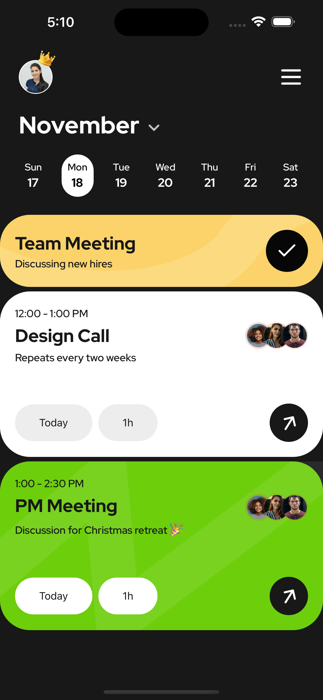
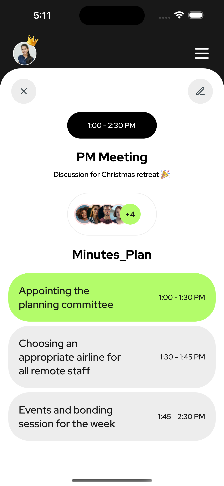
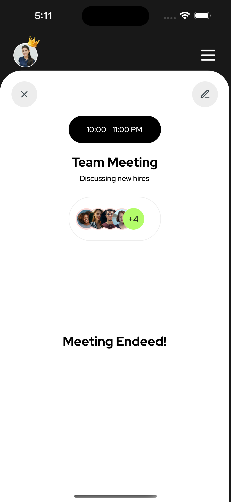

# Welcome to My Event Calendar App 👋

## Overview

The Event Calendar App is a modern web application designed to help users manage and view events in a clean, user-friendly interface. The app allows users to view events in a weekly format, access event details, and navigate through the app effortlessly with an intuitive navigation bar.

This app leverages React for efficient rendering and context management, making it easy to handle state across components. It also demonstrates modular code architecture by separating assets and data (icons and events) to simulate a database-like structure.

## Features

- **Event Overview**: Displays a list of events in a weekly overview format.
- **Event Details**: Users can click on an event to view detailed information.
- **Custom Navigation Bar**: Includes user profile, crown icon, and a menu icon for navigation. It provides a smooth user experience with intuitive routing.
- **Responsive Design**: Ensures the app is fully responsive and looks great on all screen sizes using CSS media queries.
- **Custom Fonts**: The app uses custom fonts from the "RedHatDisplay" family, which enhances readability and aesthetics.
- **State Management**: Uses React Context to manage event visibility and interaction across the app.
- **Separation of Icons and Events**: Icons and events are stored separately to simulate a database-like structure, allowing for a more modular and scalable approach to managing assets and data:
  - **Icons**: Stored separately, ensuring easy updates and maintenance without interfering with other parts of the app.
  - **Events**: Event data (e.g., event names, timings, images) is organized to simulate a database, making it easy to manage and update data without disrupting the UI.

## Screenshots

### Home Page



### When an Upcoming Event is Clicked



### When a Completed Event is Clicked



## Installation

To run this project locally, follow these steps:

1. **Clone the repository:**
   `git clone https://github.com/yourusername/event-calendar-app.git`
   `cd Settle-Calender-App`

2. **Install dependencies**:
   `npm install`

3. **Install dependencies**:
   `npm start`
4. The app will open in your default browser at http://localhost:3000.

## Technologies Used

- React: For building the user interface and handling component states.
- React Context: For managing global state and handling event details.
- CSS: For styling the app with responsive design.
- Custom Fonts: "RedHatDisplay" font family for better readability and aesthetic appeal.

## File Structure

**The file structure of the project is organized for easy scalability and maintenance**:

```
/src
/components
/EventList.js # Lists all events in a weekly format
/EventDetail.js # Displays detailed information about an event
/Navbar.js # The custom navigation bar
/assets
/icons # Folder containing icons used in the app
/data
/events.js # File simulating a database with event data
/App.js # Main component that brings everything together
/context.js # React context for managing event visibility and global state
```
